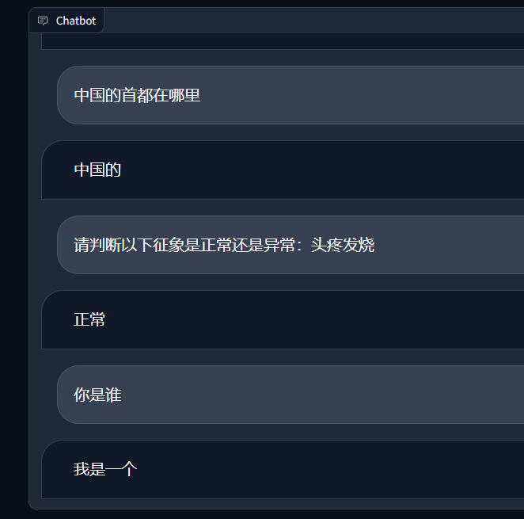
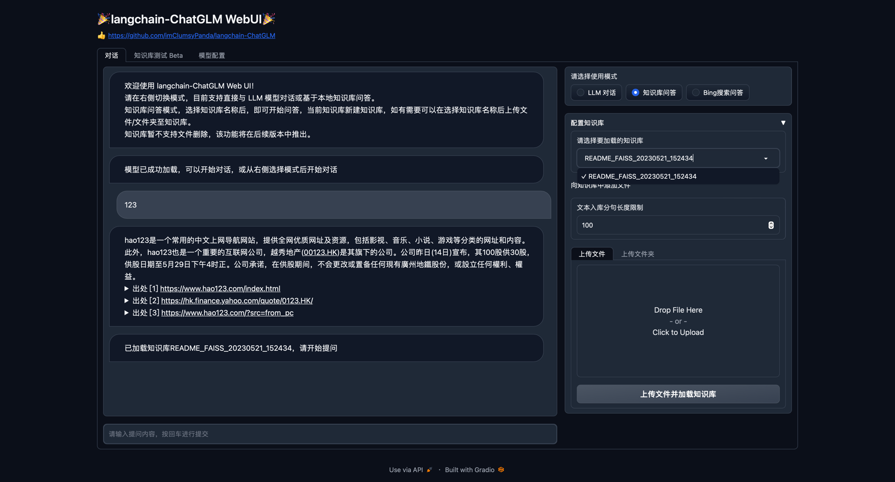
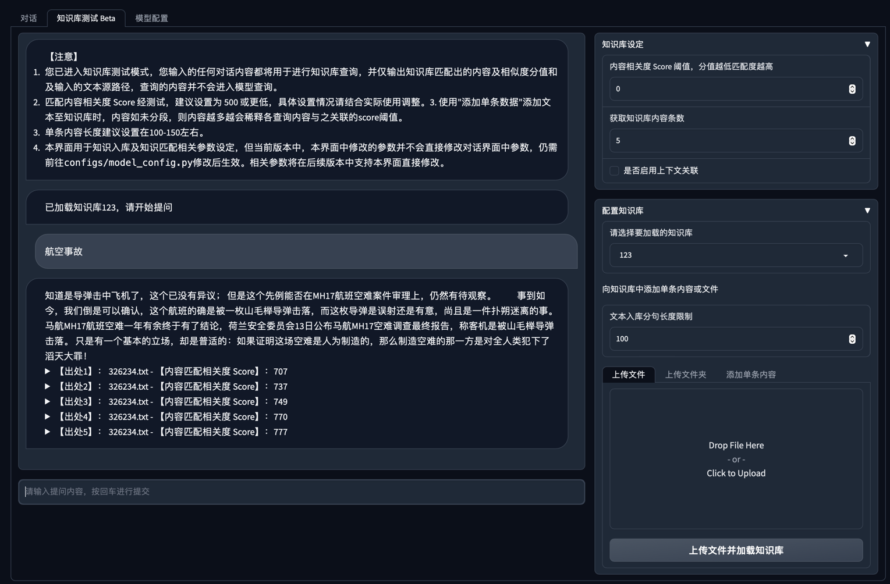
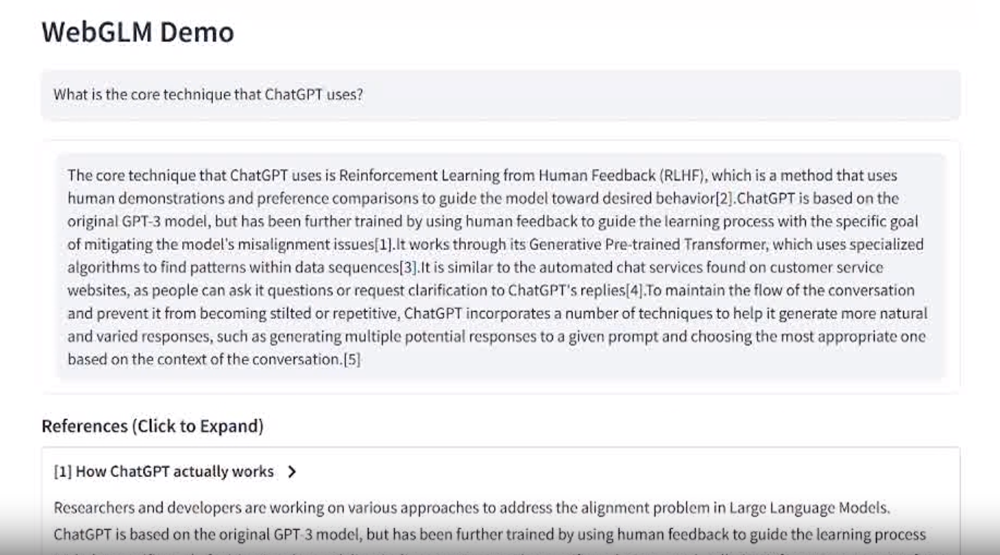
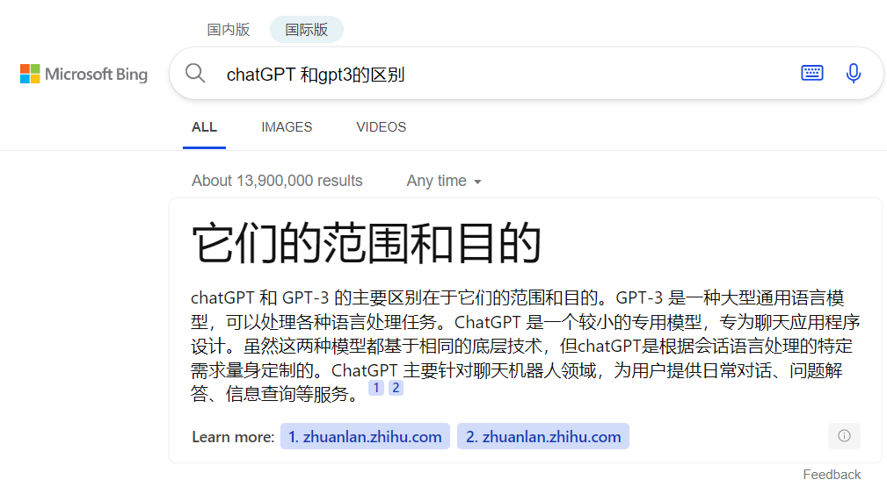

# 构建知识库的五种方式
参考 [如何用大语言模型构建一个知识问答系统](https://mp.weixin.qq.com/s?__biz=MjM5ODYwMjI2MA==&mid=2649779506&idx=1&sn=d6406a827808b2887b959bb6b2b05976&chksm=beccfe4989bb775fea0aaa0d538787f3e7c06307eee75353287467da9234444b44b11099dec9&mpshare=1&scene=23&srcid=0629HJnQWf1pg0SrG2pFgwTs&sharer_sharetime)
主要目的：      
- 本地知识的信息检索，相当于搜索引擎，必要的时候可以整合相关知识并给出回答
- 给出一段话，从中提取包含的疾病种类，要求严格按照给定的字典的内容输出，类似文本分类

## 一、传统搜索
简介：直接搜索文本或者查找目录      
优点：      
- 最简单，但搜索起来比较费时
缺点：      
- 达不到传统搜索引擎的技术水平，搜索质量比较低；完全按照字符匹配成功率很低

## 二、利用大语言模型，在prompt中提供知识信息
简介：直接在prompt中给出几个例子，要求其按照例子格式回答      
优点：      
- 开箱即用，操作简单，准备好例子直接问即可
缺点：      
- 对于语言模型的要求非常高，比如ChatGPT这种通常结果才比较准确，导致不方便本地部署，或者长期使用有一定的费用
- 输入的知识信息长度有限制，目前ChatGPT最长大约32K token,粗略估计一万字左右，文本数量特别高的知识可能不是很适用

## 三、大语言模型微调
简介：准备一些问答数据对模型微调，让模型能模仿问答的风格内容      
优点：      
- 在特定领域可能会有比较好的效果
- 可以本地部署
缺点：      
- 不能开箱即用，需要准备数据
- 知识不能很方便的更新，如果更新就相当于要重新做一次微调，通常适用于一些变化不大的内容
- 相比其他四种方法，回答的内容不能直接追溯参考资料来源
技巧：      
- 数据量理论上越多越好，不过参考一些文献，少的一般在一万条左右
- 模型的用途主要取决于训练的数据，高质量的数据有助于提高模型效果
- 多个用途可以同时在一个模型中实现，通过构造对话数据保持其用途的多样性，甚至有可能融会贯通
- 利用已有知识，构造对话数据，为降低数据标注量，有时候借助ChatGPT生成，人工筛选过滤，参考[基于中文医学知识的LLaMA微调模型](https://github.com/SCIR-HI/Huatuo-Llama-Med-Chinese)

## 四、根据文本相似度搜索和整合
简介：通过比较知识库中的片段与问题的相关性来实现信息检索，检索出的内容可以通过语言模型整合，一些类似的工具见附录
优点：      
- 开箱即用，每次更新知识不需要重新训练或者微调
缺点：      
- 非ChatGPT的通用的模型用在专业领域上，由于有很多专有名词，可能效果不是特别好，导致最后检索的匹配度低
技巧：      
- 在langchain+ChatGLM6B中默认采用的是按字数切分片段，调整文本切分的方式，可能提高匹配效果,参考[用ChatGPT搭建代码知识库，提升开发效率](https://mp.weixin.qq.com/s?__biz=MjM5ODYwMjI2MA==&mid=2649779584&idx=1&sn=2d45a03e065d0dff940b068684bf50ce&chksm=beccfefb89bb77ed07ebf41e494a0c2e3c6919cf04ed9ec2e24240f9d7d034de9827b7ec4f49&mpshare=1&scene=23&srcid=0703XbOnk2pbzi6qTrSLPHD7&sharer_sharetime=1688396036927&sharer_shareid=8aa14976e4b0d2ff22d3b315f6bcd3e5#rd)
- 对知识库格式的编排，可能需要一些特定的格式，比如在从报告中提取疾病特征的时候，知识库不能单纯是疾病名称，可能是我们的标注信息，包含了自由文本和对应的疾病

## 五、微调后再进行文本相似度检索
简介：用专业领域进行训练过的模型基础上，根据文本相似度搜索      
优点：      
- 便于本地部署
- 可能具备专业领域知识
- 可能在一些任务上不需要再次微调，保留扩展性
- 回答的内容能直接追溯参考资料来源
缺点：      
- 不能开箱即用，需要准备数据和一些开发成本
- 目前没有看到直接的参考例子，不知道技术可行性如何，从ChatGPT的一些资料看，理论上可行（传言chatGPT4就是8个专家模型构成的）

技巧：
- 可以借助现有的一些医疗语料库训练过的模型做知识库
- 需要保持语言能力，在数据比较少的情况下，可能需要一些公开问答数据集，或者降低epoch数量,下图是我们只用固定格式数据集训练后模型的结果

## 常见问题
### 微调和langchain的知识库区别用通俗的语言解释
微调相当于把知识点牢牢记在脑子里，可能不仅仅包含搜索，还包含其他一些逻辑关系，在应用方面可能会更灵活；langchain的知识库相当于把内容浏览一遍，有问题知道从哪里查

## 附录（根据文本相似度匹配的知识库工具）
### [Qiuvr+ChatGPT](https://github.com/StanGirard/quivr)
简介：      
优点：      
- 支持多种格式，文本、音频、视频、pdf、office
缺点：依赖ChatGPT，无法本地部署，收费
### [Langchain+本地语言模型](https://github.com/imClumsyPanda/langchain-ChatGLM)
简介：
优点：
- 本地部署
- 对回答结果给出出处
缺点：
- 相比微调，对一些专业词汇的处理可能比较差，降低检索效果   

### [WebGLM](https://github.com/THUDM/WebGLM)
简介：更类似一个在线搜索引擎,搜索对应的内容，然后对内容进行理解整合回答，并给出出处      
优点：      
- 给出的内容，可以将出处列出来，方便核实信息的真实性，不过这种形式在本地知识库中也可以体现
缺点：
- 目前只是在线内容聚合，一些搜索引擎如bing也有类似简介

