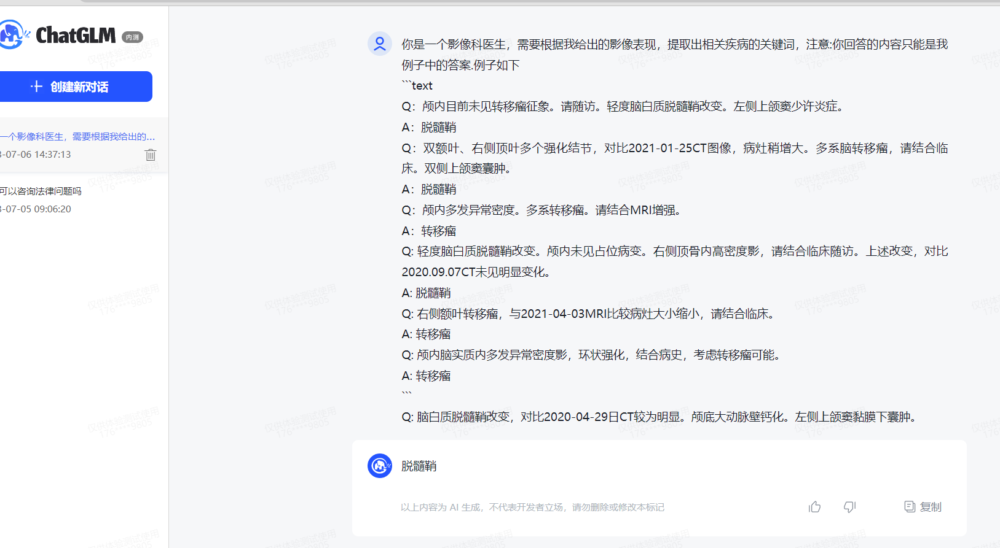
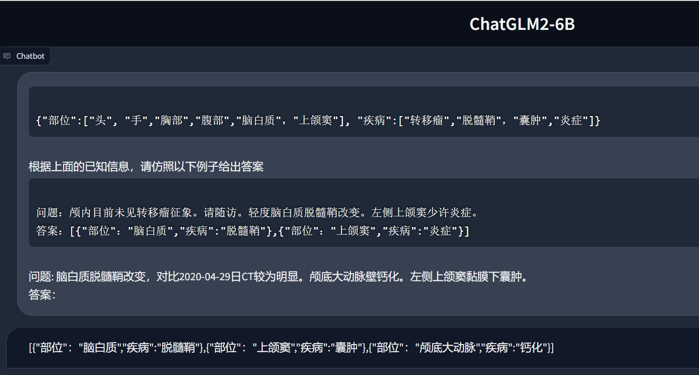
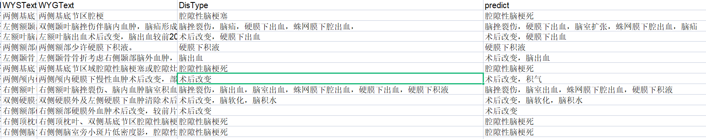

# 构建知识库的五种方式
参考 [如何用大语言模型构建一个知识问答系统](https://mp.weixin.qq.com/s?__biz=MjM5ODYwMjI2MA==&mid=2649779506&idx=1&sn=d6406a827808b2887b959bb6b2b05976&chksm=beccfe4989bb775fea0aaa0d538787f3e7c06307eee75353287467da9234444b44b11099dec9&mpshare=1&scene=23&srcid=0629HJnQWf1pg0SrG2pFgwTs&sharer_sharetime)
主要目的：      
- 本地知识的信息检索,相当于搜索引擎,必要的时候可以整合相关知识并给出回答
- 给出一段话,从中提取包含的疾病种类,要求严格按照给定的字典的内容输出,类似文本分类

主要从以下几个方面对比：

| 方法                                            | 开箱即用,不需要准备数据 | 能否灵活匹配想要的内容 | 可追溯 | 不限制文本长度 | 可本地部署 | 具备专业领域的能力 | 方便扩展知识 |
| ----------------------------------------------- | ------------------------ | ---------------------- | ------ | -------------- | ---------- | ------------------ | ------------ |
| 传统搜索                                        | √                        | ×                      | √      | √              | √          | ×                  | √            |
| 利用ChatGPT等大语言模型,在prompt中提供知识信息 | √                        | √                      | √      | ×              | ×          | √                  | √            |
| 根据文本相似度搜索和整合                        | √                        | √                      | √      | √              | √          | ×                  | √            |
| 大语言模型微调                                  | ×                        | √                      | ×      | √              | √          | √                  | ×            |
| 微调后再进行文本相似度检索                      | ×                        | √                      | √      | √              | √          | √                  | √            |

总结：在专业领域,小一点的通用语言模型配合一定数量数据微调,可能达到接近ChatGPT的水平,目前我倾向于微调后再进行文本相似度检索的方法,针对医疗领域,可能需要医疗领域的基础模型,或者我们自己构建一部分具体任务所需的数据集进行微调,再结合文本相似度进行检索,中间会涉及一些技术细节进行优化,目前已知的是以下三点：
- 数据集的构建尽量多样化,以免语言模型的语言能力丧失
- 文本相似度比较的时候,文本的切片方式尽可能保证每条信息的完整性
- 用于文本相似度比较的词向量模型可能也需要进行训练
- 检索的知识库作为prompt,给模型判断提供参考


详细内容见下文

## 一、传统搜索

#### 简介：
直接搜索文本或者查找目录      
#### 优点：      
- 最简单,但搜索起来比较费时
#### 缺点：      
- 达不到传统搜索引擎的技术水平,搜索质量比较低；完全按照字符匹配成功率很低

## 二、利用大语言模型,在prompt中提供知识信息
#### 简介：
直接在prompt中给出几个例子,要求其按照例子格式回答


#### 优点：      
- 开箱即用,操作简单,准备好例子直接问即可
#### 缺点：
- 输入的知识信息长度有限制,目前ChatGPT最长大约32K token,粗略估计一万字左右,文本数量特别高的知识可能不是很适用
- 对于语言模型的要求可能非常高,比如ChatGPT这种通常结果才比较准确,导致不方便本地部署,或者长期使用有一定的费用

#### 技巧
- 如果直接用开源的小型的语言模型,最好能知道用了哪些数据集,如果不知道,可以通过尝试不同的prompt来找模型能理解的表达方式（Prompt Engineer）
好的prompt：请仿照以下例子给出答案   

不好的prompt：你是一个影像科医生,需要根据我给出的影像表现,提取出相关疾病的关键词.例子如下   
    
[更详细的prompt测评结果](http://note.youdao.com/noteshare?id=840c8c27eafa72d6ec50d18133b4b147)


## 三、根据文本相似度搜索和整合
#### 简介：
通过比较知识库中的片段与问题的相关性来实现信息检索,检索出的内容可以通过语言模型整合,一些类似的工具见附录

#### 优点：      
- 开箱即用,每次更新知识不需要重新训练或者微调
#### 缺点：      
- 非ChatGPT的通用的模型用在专业领域上,由于有很多专有名词,可能效果不是特别好,导致最后检索的匹配度低
#### 技巧：      
- 在langchain+ChatGLM6B中默认采用的是按字数切分片段,调整文本切分的方式,可能提高匹配效果,参考[用ChatGPT搭建代码知识库,提升开发效率](https://mp.weixin.qq.com/s?__biz=MjM5ODYwMjI2MA==&mid=2649779584&idx=1&sn=2d45a03e065d0dff940b068684bf50ce&chksm=beccfefb89bb77ed07ebf41e494a0c2e3c6919cf04ed9ec2e24240f9d7d034de9827b7ec4f49&mpshare=1&scene=23&srcid=0703XbOnk2pbzi6qTrSLPHD7&sharer_sharetime=1688396036927&sharer_shareid=8aa14976e4b0d2ff22d3b315f6bcd3e5#rd)
- 对知识库格式的编排,可能需要一些特定的格式,比如在从报告中提取疾病特征的时候,知识库不能单纯是疾病名称,可能是我们的标注信息,包含了自由文本和对应的疾病
#### 技术方案
##### 数据对象
词集   
word_collections   
```json
{
  "id": "some_collection",
  "title": "部位"
}
```

集合中的词条   
words   
```json
{
  "id": "some_item",
  "category_id": "some_collection",
  "title": "转移瘤",
  "synonyms":["转移","转移灶"]
}
```

模型角色/功能   
instructions   
```json
{
    "id":"some_instruction",
    "instruction":"提取部位和疾病"
}
```

问答数据   
qa_examples   
```json
{
  "id": "some_example",
  "instruction_id": "some_instruction",
  "input":"颅内目前未见转移瘤征象。请随访。轻度脑白质脱髓鞘改变。左侧上颌窦少许炎症。",
  "target":"[{\"部位\":\"脑白质\",\"疾病\":\"脱髓鞘\"},{\"部位\"：\"上颌窦\",\"疾病\":\"炎症\"}]"
}
```

##### prompt:
```
{"部位":["头", "手","胸部","腹部","脑白质"，"上颌窦"], "疾病":["转移瘤","脱髓鞘"，"囊肿","炎症"]}
```
根据上面的已知信息，请仿照以下例子给出答案
```
问题：颅内目前未见转移瘤征象。请随访。轻度脑白质脱髓鞘改变。左侧上颌窦少许炎症。
答案：[{"部位"："脑白质","疾病":"脱髓鞘"},{"部位"："上颌窦","疾病":"炎症"}]
```
问题: 脑白质脱髓鞘改变，对比2020-04-29日CT较为明显。颅底大动脉壁钙化。左侧上颌窦黏膜下囊肿。
答案：



## 四、大语言模型微调
#### 简介：
准备一些问答数据对模型微调,让模型能模仿问答的风格内容      

训练数据格式
```json
[
  {"prompt": "长城h3风扇不转。继电器好的。保险丝好的传感器新的风扇也新的这是为什么。就是继电器缺一个信号线", "response": "用电脑能读数据流吗？水温多少", "history": []}
  {"prompt": "95", "response": "上下水管温差怎么样啊？空气是不是都排干净了呢？", "history": [["长城h3风扇不转。继电器好的。保险丝好的传感器新的风扇也新的这是为什么。就是继电器缺一个信号线", "用电脑能读数据流吗？水温多少"]]}
  {"prompt": "是的。上下水管都好的", "response": "那就要检查线路了,一般风扇继电器是由电脑控制吸合的,如果电路存在断路,或者电脑坏了的话会出现继电器不吸合的情况！", "history": [["长城h3风扇不转。继电器好的。保险丝好的传感器新的风扇也新的这是为什么。就是继电器缺一个信号线", "用电脑能读数据流吗？水温多少"], ["95", "上下水管温差怎么样啊？空气是不是都排干净了呢？"]]}
]
```

#### 优点：      
- 在特定任务会有比较好的效果,目前两千多条训练数据,模型结果可以高达90%左右,准确度高
- 可以本地部署
#### 缺点：      
- 不能开箱即用,需要准备数据
- 知识不能很方便的更新,如果更新就相当于要重新做一次微调,通常适用于一些变化不大的内容
- 相比其他四种方法,回答的内容不能直接追溯参考资料来源
- 数据如果不够多样,模型在其他领域的泛化能力会有所降低

#### 技巧：      
- 数据量理论上越多越好,不过参考一些文献,少的一般在一万条左右
- 模型的用途主要取决于训练的数据,高质量的数据有助于提高模型效果
- 多个用途可以同时在一个模型中实现,通过构造对话数据保持其用途的多样性,甚至有可能融会贯通
- 利用已有知识,构造对话数据,为降低数据标注量,有时候借助ChatGPT生成,人工筛选过滤,参考[基于中文医学知识的LLaMA微调模型](https://github.com/SCIR-HI/Huatuo-Llama-Med-Chinese)


## 五、微调后再进行文本相似度检索
#### 简介：
用专业领域进行训练过的模型基础上,根据文本相似度搜索      
#### 优点：      
- 便于本地部署
- 可能具备专业领域知识
- 可能在一些任务上不需要再次微调,保留扩展性
- 回答的内容能直接追溯参考资料来源
#### 缺点：      
- 不能开箱即用,需要准备数据和一些开发成本
- 目前没有看到直接的参考例子,不知道技术可行性如何,从ChatGPT的一些资料看,理论上可行（传言chatGPT4就是8个专家模型构成的）

#### 技巧：
- 本质上训练一方面是让模型了解相关专业词汇,另一方面理解我们的prompt,在实际应用中我们的prompt是有专门模板的,随意提问可能会导致答非所问
- 可以借助现有的一些医疗语料库训练过的模型做知识库
- 需要保持语言能力,在数据比较少的情况下,可能需要一些公开问答数据集,增加问答的多样性,或者降低epoch数量,下图是我们只用固定格式数据集训练后模型的结果,训练数据类型单一导致丧失语言能力


## 常见问题
### 微调和langchain的知识库区别用通俗的语言解释
微调相当于把知识点牢牢记在脑子里,可能不仅仅包含搜索,还包含其他一些逻辑关系,在应用方面可能会更灵活；langchain的知识库相当于把内容浏览一遍,有问题知道从哪里查

## 附录（根据文本相似度匹配的知识库工具）
### [Qiuvr+ChatGPT](https://github.com/StanGirard/quivr)
#### 简介：      
#### 优点：      
- 支持多种格式,文本、音频、视频、pdf、office
#### 缺点：
- 依赖ChatGPT,无法本地部署,收费
### [Langchain+本地语言模型](https://github.com/imClumsyPanda/langchain-ChatGLM)
#### 简介：
#### 优点：
- 本地部署
- 对回答结果给出出处
- 支持多个语言模型,如ChatGLM,ChatGLM2, ChatYuan, moss等
#### 缺点：
- 相比微调,对一些专业词汇的处理可能比较差,降低检索效果   


### [WebGLM](https://github.com/THUDM/WebGLM)
#### 简介：
更类似一个在线搜索引擎,搜索对应的内容,然后对内容进行理解整合回答,并给出出处      
#### 优点：      
- 给出的内容,可以将出处列出来,方便核实信息的真实性,不过这种形式在本地知识库中也可以体现
#### 缺点：
- 目前只是在线内容聚合,一些搜索引擎如bing也有类似简介

